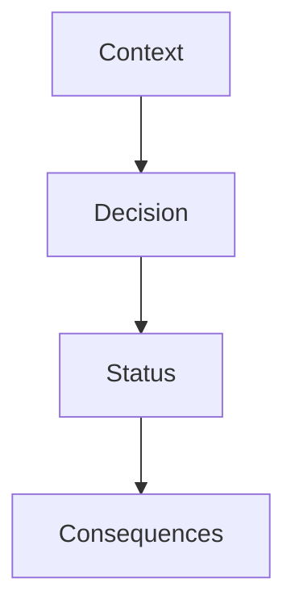

# ARCHITECTURE DECISION RECORDS
## Overview
This document contains the architectural decisions for the Yashima Engine project. Each ADR describes a choice the project team has made and provides context and consequences of that decision.

## ADR Template

## Status Categories
- Proposed: Under discussion
- Accepted: Implemented or to be implemented
- Deprecated: No longer valid but preserved
- Superseded: Replaced by a new decision

## ADR-001: Core Architecture Pattern
- Status: Accepted
- Context:
    - Need for educational clarity
    - Performance requirements
    - Resource optimization goals
    - System stability requirements
- Decision: Implement a hybrid architecture combining:
    - ML-based control system
    - Resource management layer
    - Core rendering engine
    - Platform abstraction layer
- Consequences:
  - Positive: Clear separation of concerns
  - Positive: Educational value through layering
  - Positive: Performance optimization potential
  - Negative: Initial development complexity

## ADR-002: Graphics API Selection
- Status: Accepted
- Context:
    - Need for cross-platform compatibility
    - Modern graphics API requirements
    - Educational accessibility
    - Performance considerations
- Decision: Select Vulkan as primary graphics API:
    - Modern, explicit graphics API
    - Cross-platform compatibility
    - Comprehensive debugging tools
    - Strong community support
- Consequences
    - Positive: Platform independence
    - Positive: Performance control
    - Positive: Modern feature set
    - Negative: Higher initial complexity