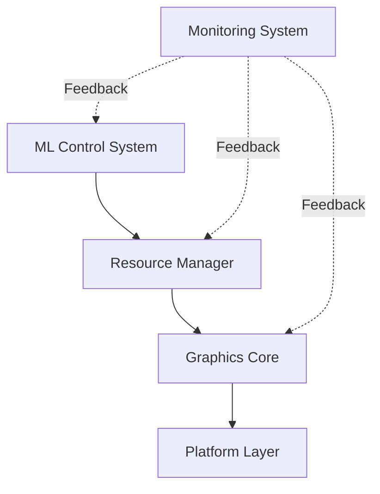
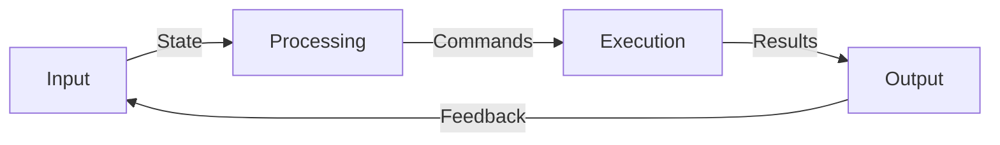
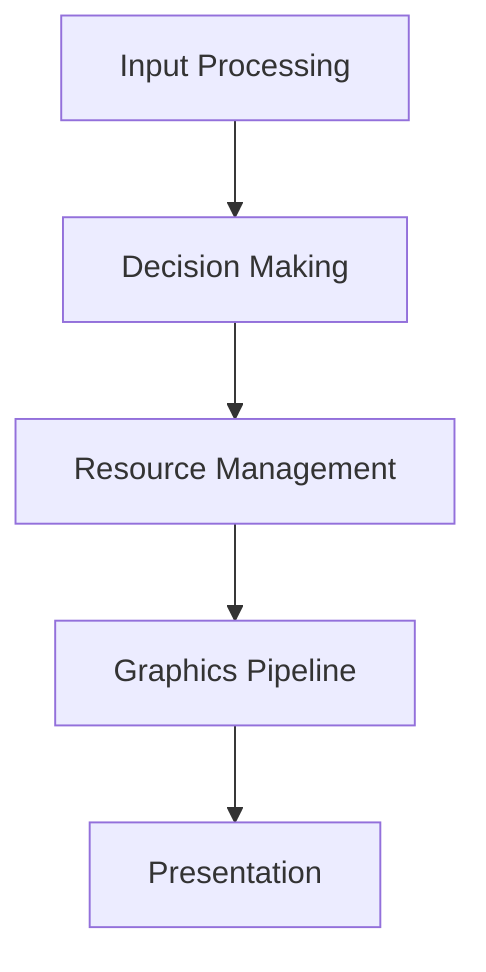

# TECHNICAL DESIGN DOCUMENT
## Document Control
| Version | Date | Author | Changes |
|:-------:|:----:|:------:|:-------:|
| 0.1 | 2024-01-25 | Aria Argenta | Initial draft |

## 1. Introduction
### 1.1 Purpose
This Technical Design Document provides detailed specifications for implementing the Yashima Engine, a graphics engine focused on educational accessibility and resource optimization. The document translates high-level architectural decisions into concrete technical specifications and implementation guidelines.

The primary objectives of this document are to:
- Define technical specifications for each system component
- Establish interface contracts between components
- Specify data structures and algorithms
- Document performance requirements and constraints
- Provide implementation guidance for developers

### 1.2 Scope
#### 1.2.1 In Scope
The document covers technical specifications for:
- ML-based resource control system
- Graphics pipeline implementation using Vulkan
- Resource management and optimization
- Platform abstraction layer
- Performance monitoring system
- Educational debugging tools

#### 1.2.2 Out of Scope
The following areas are not covered:
- Application-specific implementations
- Game engine features
- Content creation tools
- Asset pipeline details
- Platform-specific optimizations

### 1.3 References
#### 1.3.1 Internal Documents
| Document | Version | Purpose |
|:--------:|:-------:|:-------:|
| Vision and Scope | 1.0 | Project overview and objectives |
| Architecture Decision Records | 1.0 | Architectural decisions and rationale |
| API Documentation | WIP | Interface specifications |

#### 1.3.2 External References
| Reference | Version | Usage |
|:---------:|:-------:|:-----:|
| Vulkan Specification | 1.2 | Graphics API implementation |
| TensorFlow C API | 2.x | ML system implementation |
| SPIR-V Specification | 1.5 | Shader compilation |

### 1.4 Definitions and Acronyms
#### 1.4.1 Technical Terms
| Term | Definition |
|:----:|:----------:|
| ML | Machine Learning |
| TDD | Technical Design Document |
| API | Application Programming Interface |
| GPU | Graphics Processing Unit |

#### 1.4.2 Project-Specific Terms
| Term | Definition | Mathematical Basis |
|:----:|:----------:|:------------------:|
| Flow Controller | Binary state optimization system that manages system throughput based on performance metrics | Control theory: Binary State functions, O(1) decision time |
| Resource Optimizer | Continuous feedback system that manages resource allocation based on system load | Optimization theory: Constrained optimization, O(n) resource management |
| Resource | Quantifiable system asset (memory, compute time, bandwith) subject to conservation laws | Resource flow theory: Conservation equations |
| Pipeline | Directed acyclic graph of processing stages with defined input/output relationships | Graph tehory: DAG Processing, O(n) stage progression |

##### 1.4.2.1 Mathematical Foundation
Each term maps to fundamental mathematical concepts:

1. **Flow Controller**
   - Mathematical basis: Binary state functions
   - Key concept: Discrete optimization
   - Complexity: $\mathcal{O}(1)$ decision making
   - Domain: Control theory

2. **Resource Optimizer**
   - Mathematical basis: Continuous optimization
   - Key concept: Gradient-based control
   - Complexity: $\mathcal{O}(n)$ resource tracking
   - Domain: Optimization theory

3. **Resource Management**
   - Mathematical basis: Conservation equations
   - Key concept: Flow constraints
   - Complexity: $\mathcal{O}(\log n)$ allocation
   - Domain: Flow networks

4. **Pipeline Processing**
   - Mathematical basis: Graph theory
   - Key concept: Sequential dependencies
   - Complexity: $\mathcal{O}(n)$ processing
   - Domain: DAG processing

##### 1.4.2.2 Theoretical Framework
| Concept | Mathematical Model | Performance Characteristics |
|:-------:|:------------------:|:---------------------------:|
| Flow Control | $f(x) \in \{0,1\}$  |  $\mathcal{O}(1)$ decision complexity  |
| Resource Optimization | $f: \mathbb{R}^n \rightarrow \mathbb{R}$ | $\mathcal{O}(n)$ optimization complexity |
| Resource Flow | $\sum\limits_{i=1}^n R_{in,i}(t) = \sum\limits_{i=1}^n R_{out,i}(t), \quad \forall t \geq 0$ | $\mathcal{O}(\log n)$ allocation complexity |
| Pipeline Execution | $G(V,E): V = \{v_1,...,v_n\}$  | $\mathcal{O}(n)$ processing complexity  |

Additional Constraints:
- Flow Conservation: $\frac{\partial R}{\partial t} + \nabla \cdot \mathbf{F} = 0$
- Resource Bounds: $0 \leq R_i \leq R_{max}, \forall i \in \{1,...,n\}$
- Pipeline Ordering: $(v_i, v_j) \in E \implies i < j$

### 1.5 Document Conventions
#### 1.5.1 Technical Specifications
- All memory sizes in powers of 2
- Time measurements in milliseconds
- Performance metrics in frames per second
- Resource limits as explicit constants

#### 1.5.2 Implementation Notes
- Code examples in C++17 standard
- API definitions in C
- Shader code in SPIR-V assembly
- Configuration in YAML

### 1.2 Scope
- Core engine components
- Resource management system
- ML control system
- Graphics pipeline
- Platform abstraction layer

### 1.3 References
- Vision and Scope Document
- Architecture Decision Records
- Vulkan Specification
- TensorFlow C API Documentation

## 2. System Overview
### 2.1 Component Architecture

### 2.2 Data Flow

## 3. Component Specifications
### 3.1 ML Control System
- Binary decision engine
- Resource state monitoring
- Performance optimization
- Feedback processing

### 3.2 Resource Management
- Memory allocation strategies
- Resource pooling
- Load balancing
- State tracking

### 3.3 Graphics Core
- Vulkan implementation
- Render pipeline
- Resource handling
- Synchronization

### 3.4 Platform Layer
- Hardware abstraction
- API interfaces
- System integration
- Performance monitoring

## 4. Interface Specifications
### 4.1 Internal Interfaces
- Component communication protocols
- Data structures
- Error handling
- State management

### 4.2 External Interfaces
- Public API design
- Extension points
- Integration guidelines
- Documentation requirements

## 5. Data Structures
### 5.1 Core Data Types
- Resource descriptors
- State containers
- Command structures
- Event types

### 5.2 Memory Layout
- Alignment requirements
- Cache considerations
- Buffer organizations
- Pool structures

## 6. Algorithms and Processes
### 6.1 Resource Allocation
- Allocation strategies
- Deallocation procedures
- Fragmentation management
- Memory pooling

### 6.2 ML Control Flow
- Decision making process
- State evaluation
- Response generation
- Feedback integration

### 6.3 Graphics Pipeline
- Command generation
- Resource binding
- Synchronization
- Presentation

## 7. Error Handling
### 7.1 Error Categories
- System errors
- Resource errors
- Runtime errors
- User errors

### 7.2 Recovery Procedures
- Error detection
- Recovery strategies
- Fallback mechanisms
- Error reporting

## 8. Performance Considerations
### 8.1 Critical Paths

### 8.2 Optimization Strategies
- Memory access patterns
- Command batching
- Resource reuse
- State management

## 9. Security Considerations
### 9.1 Resource Protection
- Access control
- Resource isolation
- Validation checks
- Error boundaries

### 9.2 Input Validation
- Data sanitization
- Boundary checking
- Type safety
- Error handling

## 10. Testing Strategy
### 10.1 Unit Testing
- Component tests
- Interface testing
- Error handling
- Performance validation

### 10.2 Integration Testing
- System integration
- Component interaction
- End-to-end testing
- Performance benchmarking

## 11. Deployment Considerations
### 11.1 Build Process
- Compilation requirements
- Dependency management
- Platform specifics
- Distribution packaging

### 11.2 Installation
- System requirements
- Configuration
- Validation
- Troubleshooting

## 12. Maintenance and Support
### 12.1 Monitoring
- Performance metrics
- Resource usage
- Error tracking
- Usage patterns

### 12.2 Debugging
- Debug interfaces
- Logging system
- Trace capabilities
- Analysis tools

## Appendices
### A. Glossary
- Technical terms
- Abbreviations
- Domain-specific terminology

### B. References
- Technical standards
- External dependencies
- Related documentation

### C. Change Log
- Design evolution
- Major changes
- Version history