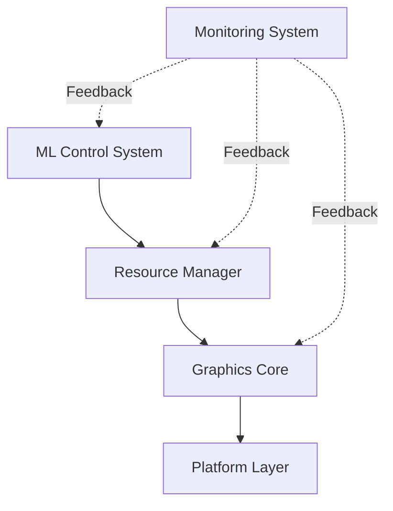
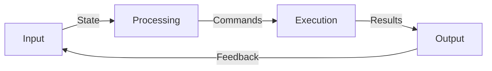
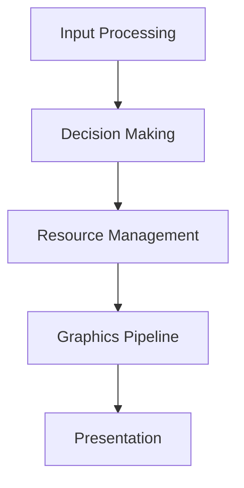

# TECHNICAL DESIGN DOCUMENT
## Document Control
| Version | Date | Author | Changes |
|:-------:|:----:|:------:|:-------:|
| 0.1 | 2024-01-25 | Aria Argenta | Initial draft |

## 1. Introduction
### 1.1 Purpose
This document provides the technical design specifications for the Yashima Engine, translating architectural decisions into concrete implementation guidelines.

### 1.2 Scope
- Core engine components
- Resource management system
- ML control system
- Graphics pipeline
- Platform abstraction layer

### 1.3 References
- Vision and Scope Document
- Architecture Decision Records
- Vulkan Specification
- TensorFlow C API Documentation

## 2. System Overview
### 2.1 Component Architecture

### 2.2 Data Flow

## 3. Component Specifications
### 3.1 ML Control System
- Binary decision engine
- Resource state monitoring
- Performance optimization
- Feedback processing

### 3.2 Resource Management
- Memory allocation strategies
- Resource pooling
- Load balancing
- State tracking

### 3.3 Graphics Core
- Vulkan implementation
- Render pipeline
- Resource handling
- Synchronization

### 3.4 Platform Layer
- Hardware abstraction
- API interfaces
- System integration
- Performance monitoring

## 4. Interface Specifications
### 4.1 Internal Interfaces
- Component communication protocols
- Data structures
- Error handling
- State management

### 4.2 External Interfaces
- Public API design
- Extension points
- Integration guidelines
- Documentation requirements

## 5. Data Structures
### 5.1 Core Data Types
- Resource descriptors
- State containers
- Command structures
- Event types

### 5.2 Memory Layout
- Alignment requirements
- Cache considerations
- Buffer organizations
- Pool structures

## 6. Algorithms and Processes
### 6.1 Resource Allocation
- Allocation strategies
- Deallocation procedures
- Fragmentation management
- Memory pooling

### 6.2 ML Control Flow
- Decision making process
- State evaluation
- Response generation
- Feedback integration

### 6.3 Graphics Pipeline
- Command generation
- Resource binding
- Synchronization
- Presentation

## 7. Error Handling
### 7.1 Error Categories
- System errors
- Resource errors
- Runtime errors
- User errors

### 7.2 Recovery Procedures
- Error detection
- Recovery strategies
- Fallback mechanisms
- Error reporting

## 8. Performance Considerations
### 8.1 Critical Paths

### 8.2 Optimization Strategies
- Memory access patterns
- Command batching
- Resource reuse
- State management

## 9. Security Considerations
### 9.1 Resource Protection
- Access control
- Resource isolation
- Validation checks
- Error boundaries

### 9.2 Input Validation
- Data sanitization
- Boundary checking
- Type safety
- Error handling

## 10. Testing Strategy
### 10.1 Unit Testing
- Component tests
- Interface testing
- Error handling
- Performance validation

### 10.2 Integration Testing
- System integration
- Component interaction
- End-to-end testing
- Performance benchmarking

## 11. Deployment Considerations
### 11.1 Build Process
- Compilation requirements
- Dependency management
- Platform specifics
- Distribution packaging

### 11.2 Installation
- System requirements
- Configuration
- Validation
- Troubleshooting

## 12. Maintenance and Support
### 12.1 Monitoring
- Performance metrics
- Resource usage
- Error tracking
- Usage patterns

### 12.2 Debugging
- Debug interfaces
- Logging system
- Trace capabilities
- Analysis tools

## Appendices
### A. Glossary
- Technical terms
- Abbreviations
- Domain-specific terminology

### B. References
- Technical standards
- External dependencies
- Related documentation

### C. Change Log
- Design evolution
- Major changes
- Version history