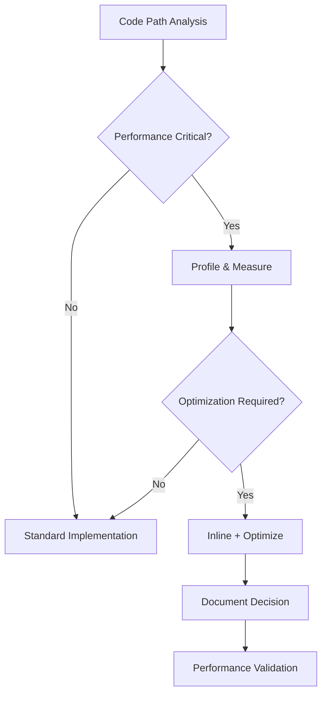
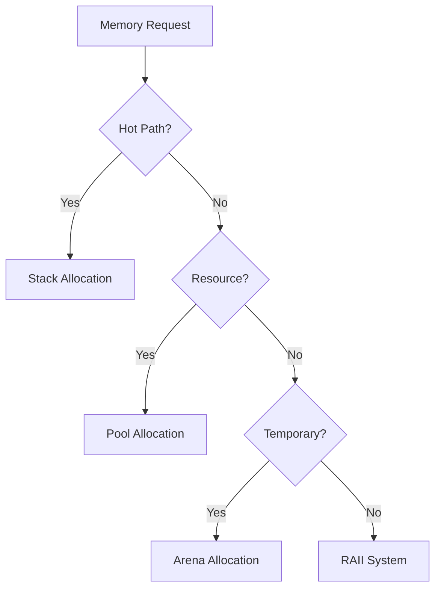
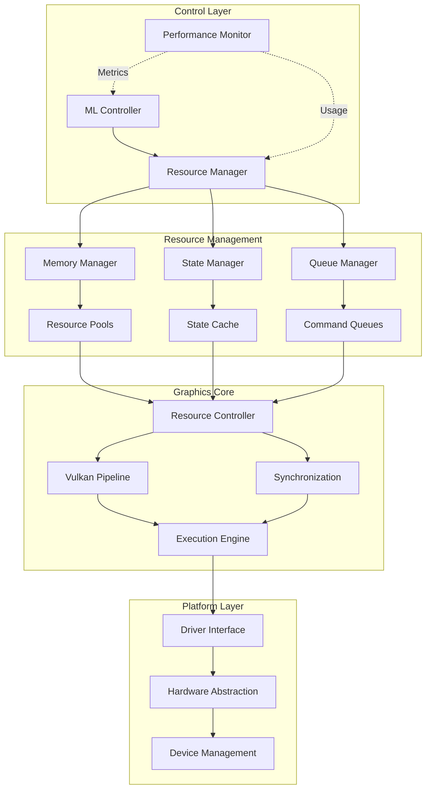
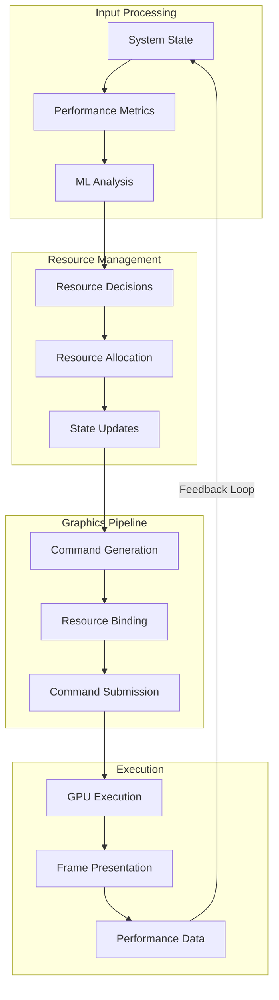
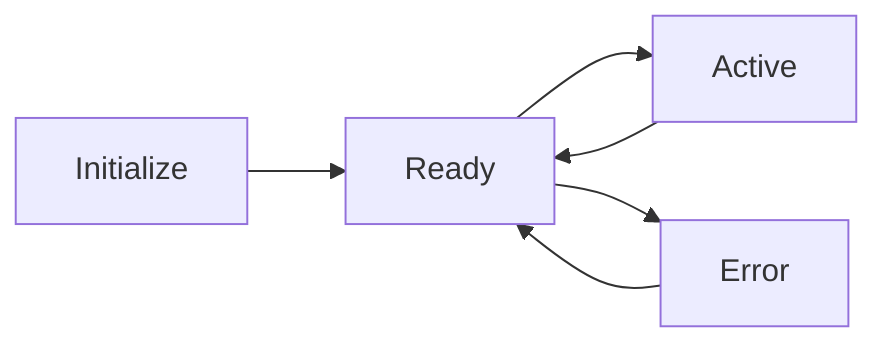
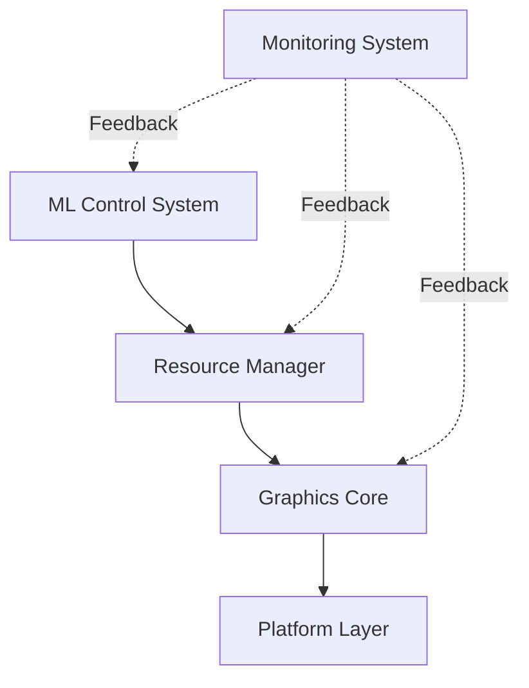
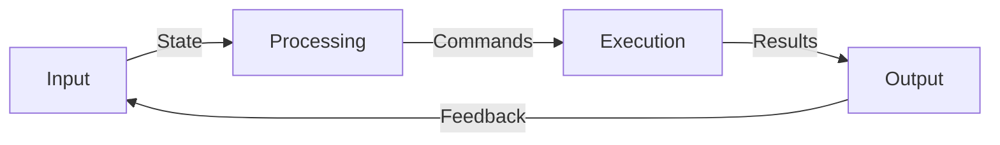
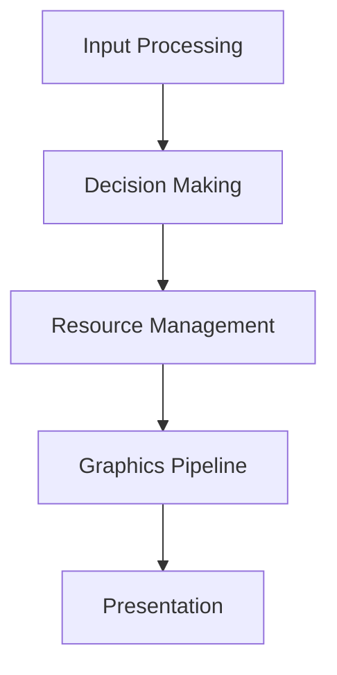

# TECHNICAL DESIGN DOCUMENT
## Document Control
| **Version** | **Date** | **Author** | **Changes** |
|:------:|:------:|:------:|:------:|
| 0.1 | 2024-01-25 | Aria Argenta | Initial draft |

--------------------------------------------------------------------------------

## Table of Contents

--------------------------------------------------------------------------------

## 1. Introduction
### 1.1 Purpose
This Technical Design Document provides detailed specifications for implementing the Yashima Engine, a graphics engine focused on educational accessibility and resource optimization. The document translates high-level architectural decisions into concrete technical specifications and implementation guidelines.

The primary objectives of this document are to:
- Define technical specifications for each system component
- Establish interface contracts between components
- Specify data structures and algorithms
- Document performance requirements and constraints
- Provide implementation guidance for developers

### 1.2 Scope
#### 1.2.1 In Scope
The document covers technical specifications for:
- ML-based resource control system
- Graphics pipeline implementation using Vulkan
- Resource management and optimization
- Platform abstraction layer
- Performance monitoring system
- Educational debugging tools

#### 1.2.2 Out of Scope
The following areas are not covered:
- Application-specific implementations
- Game engine features
- Content creation tools
- Asset pipeline details
- Platform-specific optimizations

### 1.3 References
#### 1.3.1 Internal Documents
| **Document** | **Version** | **Purpose** |
|:------:|:------:|:------:|
| Vision and Scope | 1.0 | Project overview and objectives |
| Architecture Decision Records | 1.0 | Architectural decisions and rationale |
| API Documentation | WIP | Interface specifications |

#### 1.3.2 External References
| **Reference** | **Version** | **Usage** |
|:------:|:------:|:------:|
| Vulkan Specification | 1.2 | Graphics API implementation |
| TensorFlow C API | 2.x | ML system implementation |
| SPIR-V Specification | 1.5 | Shader compilation |

--------------------------------------------------------------------------------

## 2. Definitions and Acronyms
### 2.1 Technical Terms
| **Term** | **Definition** |
|:------:|:------:|
| ML | Machine Learning |
| TDD | Technical Design Document |
| API | Application Programming Interface |
| GPU | Graphics Processing Unit |

### 2.2 Project-Specific Terms
| **Term** | **Definition** | **Mathematical Basis** |
|:------:|:------:|:------:|
| Flow Controller | Binary state optimization system that manages system throughput based on performance metrics | Control theory: Binary State functions, $\mathcal{O}(1)$ decision time |
| Resource Optimizer | Continuous feedback system that manages resource allocation based on system load | Optimization theory: Constrained optimization, $\mathcal{O}(n)$ resource management |
| Resource | Quantifiable system asset (memory, compute time, bandwith) subject to conservation laws | Resource flow theory: Conservation equations |
| Pipeline | Directed acyclic graph of processing stages with defined input/output relationships | Graph tehory: DAG Processing, $\mathcal{O}(n)$ stage progression |

--------------------------------------------------------------------------------

## 3. Mathematical Foundation
Each term maps to fundamental mathematical concepts:

1. **Flow Controller**
   - Mathematical basis: Binary state functions
   - Key concept: Discrete optimization
   - Complexity: $\mathcal{O}(1)$ decision making
   - Domain: Control theory

2. **Resource Optimizer**
   - Mathematical basis: Continuous optimization
   - Key concept: Gradient-based control
   - Complexity: $\mathcal{O}(n)$ resource tracking
   - Domain: Optimization theory

3. **Resource Management**
   - Mathematical basis: Conservation equations
   - Key concept: Flow constraints
   - Complexity: $\mathcal{O}(\log n)$ allocation
   - Domain: Flow networks

4. **Pipeline Processing**
   - Mathematical basis: Graph theory
   - Key concept: Sequential dependencies
   - Complexity: $\mathcal{O}(n)$ processing
   - Domain: DAG processing

--------------------------------------------------------------------------------

## 4. Theoretical Framework
| **Concept** | **Mathematical Model** | **Performance Characteristics** |
|:------:|:------:|:------:|
| Flow Control | $f(x) \in \{0,1\}$  |  $\mathcal{O}(1)$ decision complexity  |
| Resource Optimization | $f: \mathbb{R}^n \rightarrow \mathbb{R}$ | $\mathcal{O}(n)$ optimization complexity |
| Resource Flow | $\sum\limits_{i=1}^n R_{in,i}(t) = \sum\limits_{i=1}^n R_{out,i}(t), \quad \forall t \geq 0$ | $\mathcal{O}(\log n)$ allocation complexity |
| Pipeline Execution | $G(V,E): V = \{v_1,...,v_n\}$  | $\mathcal{O}(n)$ processing complexity  |

Additional Constraints:
- Flow Conservation: $\frac{\partial R}{\partial t} + \nabla \cdot \mathbf{F} = 0$
- Resource Bounds: $0 \leq R_i \leq R_{max}, \forall i \in \{1,...,n\}$
- Pipeline Ordering: $(v_i, v_j) \in E \implies i < j$

--------------------------------------------------------------------------------

## 5 Document Conventions
### 5.1 Technical Specifications
#### 5.1.1 Memory Specifications
| **Type** | **Convention** | **Example** |
|:------:|:------:|:------:|
| Memory Sizes | Powers of 2 | $2^{10}$ bytes (1KB) |
| Buffer Alignments | Multiple of cache line | 64 bytes |
| Memory Pools | Powers of 2 | $2^{20}$ bytes (1MB) |
| Stack Allocations | Fixed size blocks | 4KB blocks |
| VRAM Buffers | Multiple of 256 | 256 bytes |
| Uniform Data | Multiple of 16 | 16 bytes |

#### 5.1.2 Time Measurements
| **Metric** | **Unit** | **Precision** |
|:------:|:------:|:------:|
| Frame Time | Milliseconds (ms) | 2 decimal places |
| CPU Operations | Microseconds (μs) | 1 decimal place |
| GPU Operations | Milliseconds (ms) | 3 decimal places |
| ML Inference | Microseconds (μs) | 1 decimal place |
| Memory Transfer | Microseconds (μs) | 2 decimal place |
| State Updates | Nanoseconds (ns) | 0 decimal places |

#### 5.1.3 Performance Metrics
| **Metric** | **Notation** | **Unit** |
|:------:|:------:|:------:|
| Frame Rate | FPS | Frames per second |
| Memory Bandwidth | GB/s | Gigabytes per second |
| CPU Usage | % | Percentage of total |
| GPU Utilization | % | Percentage of total |
| Cache Hit Rate | % | Percentage of Hits |
| ML Response Rate | Hz | Decisions per second |
| Memory Fragmentation | % | Percentage of waste |
| Pipeline Stalls | Count | Stalls per frame |

#### 5.1.4 Resource Limits
| **Resource** | **Specification** | **Format** |
|:------:|:------:|:------:|
| Maximum Vertices | $2^{20}$ | Scientific notation |
| Buffer Sizes | Powers of 2 | Binary prefix |
| Thread Counts | Powers of 2 | Decimal |
| Queue Depths | Powers of 2 | Decimal |
| Batch Size | $2^{10}$ | Scientific notation |
| Descriptor Sets | $2^{8}$ | Scientific notation |
| Memory Pools | $2^{4}$ | Scientific notation |
| Command Lists | $2^{6}$ | Scientific notation |

#### 5.1.5 Numerical Representations
| **Type** | **Format** | **Precision** |
|:------:|:------:|:------:|
| Floating Point | IEEE 754 | 32/64-bit |
| Fixed Point | Q Format | 16.16 |
| Integers | Two's Complement | 32/64-bit |
| Vectors | SIMD Aligned | 128/256-bit |
| Matrix | Column Major | 4x4 float |
| Quaternions | Unit Length | 32-bit x4 |
| Normalized | [0, 1] or [-1, 1] | 32-bit |
| Half Float | IEEE 754 | 16-bit |

### 5.2 Documentation Format
| **Element** | **Convention** | **Example** |
|:------:|:------:|:------:|
| Constants | UPPER_SNAKE_CASE | MAX_BUFFER_SIZE |
| Variables | camelCase | frameCount |
| Functions | PascalCase | RenderFrame |
| Namespaces | lowercase | graphics |
| Types | PascalCase | VertexBuffer |
| Interfaces | IPascalCase | IRenderer |
| Enums | PascalCase | RenderState |
| Templates | TPascalCase | TResourceHandle |
| Structs | PascalCase | VertexData |
| Class Members | m_camelCase | m_bufferSize |
| Static Members | s_camelCase | s_instanceCount |
| Global Variables | g_camelCase | g_renderContext |
| Enum Values | k_PascalCase | k_MaxBufferSize |
| Boolean Variables | camelCase | isValid, hasData |
| Pointer Variables | pCamelCase | pBuffer |
| Reference Parameters | rCamelCase | rContext |
| Function Parameters | camelCase | bufferSize |
| Local Variables | camelCase | localIndex |
| Template Parameters | T_PascalCase | T_DataType |

### 5.3 Implementation Notes
#### 5.3.1 Code Standards
| **Language** | **Standard** | **Constraints** | **Rationale** |
|:------:|:------:|:------:|:------:|
| C | C17 | Strict aliasing rules | Low-level control |
| C++ | C++17 | No RTTI, limited exceptions | Performance critical |
| SPIR-V | 1.5 | Vulkan compatibility | Shader compilation |
| Python | 3.8+ | Build scripts only | Build automation |
| GLSL | 4.60 | Vulkan compatibility | Shader source |
| CMake | 3.20+ | Cross-platform support | Build system |
| Markdown | GitHub Flavored | Documentation | Project docs |
| JSON | RFC 8259 | Configuration files | Data format |

#### 5.3.2 API Conventions
| **Component** | **Style** | **Example** | **Rationale** |
|:------:|:------:|:------:|:------:|
| Public Functions | `[[nodiscard]]` | `[[nodiscard]] Result Initialize();` | Enforce error checking |
| Error Handling | Return codes | `ErrorCode DoOperation();` | Deterministic error handling |
| Resource Handles | Opaque types | `typedef struct Resource_T* ResourceHandle;` | Encapsulation |
| Constants | Static constexpr | `static constexpr size_t kMaxSize = 1024;` | Compile-time evaluation |
| Callbacks | Function pointers | `typedef void (*UpdateFn)(void* userData);` | C compatibility |
| Interfaces | Pure virtual | `virtual void Update() = 0;` | Plugin architecture |
| Memory Allocation | Custom allocators | `void* Allocate(size_t size, void* userData);` | Memory control |
| State Changes | State machines | `enum class State : uint8_t {};` | Predictable behavior |

### 5.4 Documentation Requirements
| **Element** | **Format** | **Purpose** | **Required Fields** |
|:------:|:------:|:------:|:------:|
| Functions | Doxygen | API documentation | `@brief, @param, @return, @note, @see` |
| Classes | Markdown | Implementation details | Overview, Methods, Examples, Limitations |
| Examples | Literate programming | Educational value | Context, Code, Output, Analysis |
| Algorithms | Pseudocode + LaTeX | Mathematical foundation | Complexity, Proof, Constrains |
| Interfaces | Doxygen + UML | Contract definition | Responsibilities, Guarantees, Usage |
| Performance | Markdown + Graphs | Optimization guide | Metrics, Bottlenecks, Solutions |
| Tutorials | Markdown + Code | Learning path | Steps, Code, Results, Exercises |
| Architecture | Mermaid + Markdown | System design | Components, Flow, Decisions |

### 5.6 Documentation Integration
#### 5.6.1 Documentation Scope
   - Source code documentation
     * API interfaces
     * Implementation details
     * Performance characteristics
   - Technical documentation
     * Architecture decisions
     * System design
     * Mathematical foundations
   - Educational materials
     * Tutorials
     * Examples
     * Exercises

#### 5.6.2 Documentation Organization
   - Source tree alignment
     * Documentation alongside code
     * Version-controlled documentation
     * Consistent structure
   - Documentation hierarchy
     * Core concepts
     * Detailed implementations
     * Educational resources

#### 5.6.3 Documentation Standards
   - Format requirements
     * API documentation (Doxygen)
     * Technical documentation (Markdown)
     * Mathematical content (LaTeX)
   - Quality requirements
     * Technical accuracy
     * Completeness
     * Educational value
   - Review requirements
     * Technical review
     * Educational review
     * Accessibility review

#### 5.6.4 Documentation Maintenance
   - Update requirements
     * Code changes
     * API changes
     * Feature additions
   - Review process
     * Technical accuracy
     * Educational value
     * Documentation quality

--------------------------------------------------------------------------------

## 6. Critical Paths

--------------------------------------------------------------------------------

## 7. Evaluation Criteria
### 7.1 Performance Critical Definition
- Executed every frame
- Part of render pipeline
- Resource management operations
- Real-time ML decisions

### 7.2 Measurement Thresholds
- Frame time impact > 1%
- Called > 1000 times/frame
- Memory operations > 1MB
- Affects multiple systems

### 7.3 Optimization Categories
| **Path Type** | **Threshold** | **Action** | **Rationale** |
|:------:|:------:|:------:|:------:|
| Frame Critical | 16ms budget | Inline + SIMD | Timing requirement for 60 FPS |
| Memory Critical | Cache line | Align + Pool | Cache coherency and memory access patterns |
| ML Critical | 100μs budget | Optimize | Real-time decision making window |
| Resource Critical | 1ms budget | Batch | Resource state management overhead |

#### 7.3.1 Frame Critical
- **Definition**: Operations that directly impact frame rendering time
- **Examples**:
    - Vertex transformation
        - Draw call submission
        - State changes
- **Impact**:
    - Direct effect on FPS
    - User experience
    - System responsiveness

#### 7.3.2 Memory Critical
- **Definition**: Operations affecting memory access patterns
- **Examples**:
    - Resource allocation
    - Buffer updates
    - Texture uploads
- **Impact**:
    - Cache performance
    - Memory bandwidth
    - System latency

#### 7.3.3 ML Critical
- **Definition**: Operations in ML decision loop
- **Examples**:
    - State evaluation
    - Resource prediction
    - Control decisions
- **Impact**:
    - System stability
    - Resource efficiency
    - Response time

#### 7.3.4 Resource Critical
- **Definition**: Operations managing system resources
- **Examples**:
    - Buffer management
    - Memory pools
    - State tracking
- **Impact**:
    - Resource availability
    - System overhead
    - Overall performance

### 7.4 Documentation Requirements
| **Aspect** | **Content** | **Purpose** | **Format** |
|:------:|:------:|:------:|:------:|
| Performance Data | Metrics & Benchmarks | Justification | Tables + Graphs |
| Optimization Strategy | Approach & Methods | Implementation | Technical description |
| Trade-offs | Costs & Benefits | Decision Record | Analysis matrix |
| Validation | Tests & Results | Verification | Test reports |

#### 7.4.1 Performance Data
- **Required Metrics**:
    - Baseline performance
    - Optimized performance
    - Resource utilization
    - System impact
- **Documentation Format**:
    - Performance tables
    - Comparison graphs
    - Timeline analysis
    - Resource usage charts

#### 7.4.2 Optimization Strategy
- **Required Elements**:
    - Problem analysis
    - Solution approach
    - Implementation method
    - Expected outcomes
- **Documentation Format**:
    - Technical description
    - Code examples
    - Algorithm analysis
    - Performance models

#### 7.4.3 Trade-offs
- **Required Analysis**:
    - Performance gains
    - Resource costs
    - Complexity impact
    - Maintenance implications
- **Documentation Format**:
    - Decision matrix
    - Cost-benefit analysis
    - Risk assessment
    - Long-term impact

#### 7.4.4 Validation
- **Required Evidence**:
    - Performance tests
    - Stress tests
    - Edge cases
    - System impact
- **Documentation Format**:
    - Test reports
    - Performance data
    - Validation criteria
    - Success metrics

--------------------------------------------------------------------------------

## 8. Memory Management
| **Context** | **Strategy** | **Documentation** | **Constraints** |
|:------:|:------:|:------:|:------:|
| Hot Path | Stack allocation | Performance critical | Fixed size, deterministic |
| Resources | Pool allocation | Resource lifetime | Fragmentation managed |
| Temporary | Arena allocation | Frame scope | Reset each frame |
| System | RAII patterns | Ownership model | Explicit lifetime |

### 8.1 Memory Hierarchy

### 8.2 Constraints and Limits
#### 8.2.1 Size Constrains
| **Allocation Type** | **Initial Size** | **Maximum Size** | **Growth Policy** |
|:------:|:------:|:------:|:------:|
| Stack | 1MB/thread | Fixed | None |
| Pool | 16MB | 256MB | Double |
| Arena | 4MB | 64MB | 2MB blocks |
| System | As needed | System RAM | Dynamic |

#### 8.2.2 Alignment Requirements
| **Resource Type** | **Alignment** | **Justification** |
|:------:|:------:|:------:|
| Hot Path | 64 bytes | Cache line |
| Resources | 256 bytes | GPU access |
| Temporary | 16 bytes | SIMD ops |
| System | 8 bytes | CPU natural |

--------------------------------------------------------------------------------

## 9. Performance Characteristics
### 9.1 Operation Costs
| **Strategy** | **Allocation** | **Deallocation** | **Fragmentation** |
|:------:|:------:|:------:|:------:|
| Stack | $\mathcal{O}(1)$ | $\mathcal{O}(1)$ | None |
| Pool | $\mathcal{O}(1)$ | $\mathcal{O}(1)$ | Managed |
| Arena | $\mathcal{O}(1)$ | Bulk | None |
| RAII | $\mathcal{O}(n)$ | $\mathcal{O}(1)$ | System |

### 9.2 Monitoring Thresholds
| **Aspect** | **Metric** | **Threshold** | **Action** |
|:------:|:------:|:------:|:------:|
| Stack | Peak depth | 75% | Warning |
| Pool | Fragmentation | 5% | Defrag |
| Arena | Growth/frame | 2x baseline | Investigate |
| System | Usage trend | Upward | Leak check |

### 9.3 Thread Safety Categories
| **Component** | **Guarantee** | **Documentation** | **Verification** |
|:------:|:------:|:------:|:------:|
| Public API | Thread-safe | Explicit notation | Runtime check |
| Internal | Implementation defined | Document assumptions | Static analysis |
| Resources | External sync | Mark requirements | Lock tracking |
| Callbacks | Main thread only | State requirements | Assert check |

#### 9.3.1 Public API Requirements
| **Access Pattern** | **Syncrhonization** | **Validation** |
|:------:|:------:|:------:|
| Concurrent read | Lock-free | Performance counter |
| Exclusive write | Mutex protected | Deadlock detection |
| Resource access | Atomic operations | Race detector |
| State changes | Sequential consistency | State validator |

#### 9.3.2 Internal Implementation
| **Context** | **Stategy** | **Verification** |
|:------:|:------:|:------:|
| Hot path | Lock-free | Stress test |
| Resource update | Fine-grained locks | Lock order |
| State transition | Sequential | State machine |
| Data access | Thread local | Memory order |

#### 9.3.3 Resource Management
| **Operation** | **Syncronization method** | **Requirement** |
|:------:|:------:|:------:|
| Allocation | External | Caller sync |
| Access | Internal | Auto-managed |
| Update | Hybrid | Documented |
| Release | External | Caller sync |

#### 9.3.4 Callback Handling
| **Type** | **Thread Context** | **Validation** |
|:------:|:------:|:------:|
| Update | Main thread | Assert |
| Event | Worker thread | Queue check |
| Resource | Owner thread | Thread ID |
| System | Any thread | Safety level |

### 9.4 Syncronization Methods
#### 9.4.1 Priority Order
- Lock-Free operations
- Atomic operations
- Fine-grained locks
- Coarse-grained locks

#### 9.4.2. Critical Section Management
| **Section** | **Strategy** | **Max Duration** |
|:------:|:------:|:------:|
| Hot path | Lock-free | 0μs |
| Resource | Fine lock | 100μs |
| State | Coarse lock | 1ms |
| System | Global lock | 10ms |

### 9.5 Documentation Requirements
#### 9.5.1 Required Elements
| **Element** | **Content** | **Purpose** |
|:------:|:------:|:------:|
| Thread Safety | Safety level declaration | Define concurrency guarantees |
| Sync method | Syncronization approach | Specify implementation strategy |
| Performance | Syncronization impact | Document overhead |
| Constraints | Usage requirements | Specify caller obligations |

#### 9.5.2 Safety Levels
| **Level** | **Meaning** | **Documentation** |
|:------:|:------:|:------:|
| Thread-safe | Full concurrent access | No external sync needed |
| External sync | Caller syncrhonization | Sync requirements |
| Main thread | Main thread only | Thread context |
| Implementation defined | Per-component basis | Specific details |

#### 9.5.3 Performance Annotations
| **Type** | **Annotation** | **Purpose** | **Usage Context** |
|:------:|:------:|:------:|:------:|
| Hot Path | `[[likely]]` | Branch prediction | Critical execution paths |
| Cold Path | `[[unlikely]]` | Branch prediction |  Error handling paths |
| Critical | `[[optimize]]` | Optimization level | Performance-critical sections |
| Alignment | `[[align]]` | Memory alignment |  Cache-sensitive data |

--------------------------------------------------------------------------------

## 10. Annotation Categories
### 10.1 Path Optimization
| **Context** | **Annotation Type** | **Application Criteria** |
|:------:|:------:|:------:|
| Frame critical | Hot path | >1000 calls/frame |
| Error handling | Cold path | <1% execution frequency |
| Resource management | Critical | Resource-intensive operations |
| Data structures | Alignment | Cache-line dependent access |

### 10.2 Usage Requirements
| **Annotation** | **Verification** | **Documentation** | **Impact** |
|:------:|:------:|:------:|:------:|
| Hot path | Profile data | Usage metrics | Branch prediction |
| Cold path | Error rates | Exception paths | Code layout |
| Critical | Benchmarks | Performance data | Optimization |
| Alignment | Cache analysis | Memory patters | Cache efficiency |

### 10.3 Application Criteria
#### 10.3.1 Decision Matrix
| **Scenario** | **Required Metrics** | **Threshold** | **Annotation Type** |
|:------:|:------:|:------:|:------:|
| Main loop | Execution frequency | >60Hz | Hot path |
| Error paths | Error rate | <1% | Cold path |
| Core compute | CPU time | >5% | Critical |
| Data access | Cache misses | >1% | Alignment |

#### 10.3.2 Validation Requirements
| **Type** | **Metric** | **Threshold** | **Verification Method** |
|:------:|:------:|:------:|:------:|
| Hot path | Hit rate | >95% | Performance counter |
| Cold path | Miss rate | <5% | Branch statistics |
| Critical | Speed-up | >10% | Benchmark comparison |
| Alignment | Cache hits | >95% | Cache analysis |

--------------------------------------------------------------------------------

## 11. Documentation Standards
### 11.1 Required Information
| **Element** | **Content** | **Purpose** |
|:------:|:------:|:------:|
| Rationale | Performance impact | Justify annotation |
| Metrics | Measured data | Support decision |
| Context | Usage scenario | Define scope |
| Validation | Test results | Verify effectiveness |

### 11.2 Review Requirements
| **Aspect** | **Criteria** | **Validation** |
|:------:|:------:|:------:|
| Necessity | Performace data | Benchmark results |
| Correctness | Usage pattern | Static analysis |
| Impact | System effect | Performance test |
| Maintenance | Long-term cost | Complexity analysis |

--------------------------------------------------------------------------------

## 12. Debug Support
### 12.1 Debug Features Classification
| **Feature** | **Implementation** | **Purpose** | **Overhead** |
|:------:|:------:|:------:|:------:|
| Assertions | Static analysis | Invariant checking | Zero in release |
| Logging | Ring buffer | Performance monitoring | Constant memory |
| Profiling | Instrumentation | Hot path analysis | Configurable |
| Validation | Layer system | Correctness verification | Debug only |

### 12.2 Runtime Verification
| **Feature** | **Activation** | **Impact** | **Usage Context** |
|:------:|:------:|:------:|:------:|
| Debug | Debug build | Full check | Development |
| Development | Dev build | Partial check | Testing |
| Release | Release build | Critical only | Production |
| Profile | Profile build | Performance | Optimization |

--------------------------------------------------------------------------------

## 13. Memory Requirements
| **System** | **Allocation** | **Lifetime** | **Cleanup** |
|:------:|:------:|:------:|:------:|
| Ring buffer | Fixed size | Continuous | Circular |
| Profile data | Growing | Session | Manual clear |
| Validation | Static | Build time | Automatic |
| Trace data | Bounded | Temporary | Per frame |

--------------------------------------------------------------------------------

## 14. Feature Categories
### 14.1 Assertion System
| **Level** | **Scope** | **Validation** | **Recorvery** |
|:------:|:------:|:------:|:------:|
| Fatal | System integrity | Immediate | Terminate |
| Error | Operation failure | Report | Continue |
| Warning | Potential issue | Log | Proceed |
| Info | State check | Record | Monitor |

### 14.2 Logging System
| **Priority** | **Buffer size** | **Retention** | **Analysis** |
|:------:|:------:|:------:|:------:|
| Critical | 1MB | Persistent | Immediate |
| Error | 4MB | 24h | Daily |
| Warning | 16MB | 1h | Periodic |
| Debug | 64MB | 10min | On-demand |

### 14.3 Profiling System
| **Metric** | **Collection** | **Impact** | **Usage** |
|:------:|:------:|:------:|:------:|
| Time | Frame-based | Low | Continuous |
| Memory | Per alloc | Medium | Periodic |
| GPU | Per draw | Medium | On demand |
| System | Per event | High | Manual |

### 14.4 Validation System
| **Layer** | **Scope** | **Frequency** | **Cost** |
|:------:|:------:|:------:|:------:|
| API | Interface | Always | Low |
| Resource | Allocation | High use | Medium |
| State | Transitions | Critical | Medium |
| System | Integration | Periodic | High |

### 14.5 Integration Requirements
| **Mode** | **Features** | **Overhead** | **Use Case** |
|:------:|:------:|:------:|:------:|
| Debug | All | Maximum | Development |
| Development | Most | High | Testing |
| Profile | Selected | Medium | Optimization |
| Release | Minimal | None | Production |

### 14.6 Performance Impact
| Feature | Debug | Development | Profile | Release |
|:------:|:------:|:------:|:------:|:------:|
| Assertions | 100% | 50% | 10% | 0% |
| Logging | 100% | 25% | 5% | 1% |
| Profiling | N/A | 100% | 25% | 0% |
| Validation | 100% | 50% | 10% | 0% |

--------------------------------------------------------------------------------

## 15. Build Configuration
### 15.1 Build Mode Specifications
| **Mode** | **Features** | **Use Case** | **Optimization** |
|:------:|:------:|:------:|:------:|
| Debug | Full validation | Development | None (-O0) |
| Release | No debug | Production | Maximum (-O3) |
| Profile | Instrumented | Performance analysis | Balanced (-O2) |
| Test | Coverage | Validation | Minimal (-O1) |

### 15.2 Feature Matrix
| **Feature** | **Debug** | **Release** | **Profile** | **Test** |
|:------:|:------:|:------:|:------:|:------:|
| Assertions | Yes | No | Limited | Yes |
| Symbols | Full | None | Partial | Full |
| Optimizations | Off | Full | Partial | Minimal |
| Instrumentation | Full | None | Selected | Coverage |

### 15.3 Memory Model
| **Aspect** | **Debug** | **Release** | **Profile** | **Test** |
|:------:|:------:|:------:|:------:|:------:|
| Guards | Yes | No | Limited | Yes |
| Checks | Full | None | Selected | Full |
| Tracking | Yes | No | Yes | Yes |
| Validation | Yes | No | Partial | Yes |

--------------------------------------------------------------------------------

## 16. Mode-specific Requirements
### 16.1 Debug Configuration
| **Feature** | **State** | **Purpose** | **Impact** |
|:------:|:------:|:------:|:------:|
| Validation | Enabled | Correctness | High |
| Logging | Verbose | Tracing | High |
| Checks | Maximum | Safety | High |
| Tools | All | Development | High |

### 16.2 Release Configuration
| **Feature** | **State** | **Purpose** | **Impact** |
|:------:|:------:|:------:|:------:|
| Validation | Disabled | Performance | None |
| Logging | Minimal | Errors only | Minimal |
| Checks | Critical | Stability | Minimal |
| Tools | None | Speed | None |

### 16.3 Profile Configuration
| **Feature** | **State** | **Purpose** | **Impact** |
|:------:|:------:|:------:|:------:|
| Validation | Limited | Balance | Medium |
| Logging | Selected | Analysis | Medium |
| Checks | Important | Monitoring | Medium |
| Tools | Analysis | Profiling | Medium |

### 16.4 Test Configuration
| **Feature** | **State** | **Purpose** | **Impact** |
|:------:|:------:|:------:|:------:|
| Validation | Full | Coverage | High |
| Logging | Complete | Verification | High |
| Checks | All | Testing | High |
| Tools | Testing | Validation | High |

--------------------------------------------------------------------------------

## 17. Performance Characteristics
### 17.1 Resource Usage
| **Resource** | **Debug** | **Release** | **Profile** | **Test** | **Baseline Reference** |
|:------:|:------:|:------:|:------:|:------:|:------:|
| Memory | +100% | Baseline | +50% | +100% | Runtime memory usage |
| CPU | +200% | Baseline | +50% | +150% | Runtime CPU utilization |
| Storage | +300% | Baseline | +100% | +200% | Binary size |
| Bandwidth | +100% | Baseline | +50% | +100% | I/O operation |

### 17.2 Build Items
| **Component** | **Target Time** | **Variance Allowed** | **Factors** |
|:------:|:------:|:------:|:------:|
| Debug compile | <30s | ±10s | No optimization |
| Release compile | <180s | ±30s | Full optimization |
| Profile compile | <120s | ±20s | Partial optimization |
| Test compile | <45s | ±15s | Coverage instrumentation |

**Time Measurement Criteria**:
- Based on 100K lines of code
- Using recommended hardware
- Single configuration build
- Clean build scenario

--------------------------------------------------------------------------------

## 18. System Overview
### 18.1 System Architecture
#### 18.1.1 Core Components

#### 18.1.2 Component Responsibilities
| **Component Layer** | **Component** | **Primary Role** | **Critical Requirements** | **Performance Targets** |
|:------:|:------:|:------:|:------:|:------:|
| Control Layer | ML Controller | Resource optimization decisions | Deterministic response time | 100μs decision time |
| Control Layer | Performance Monitor | System telemetry collection | Non-intrusive monitoring | 1ms sampling rate |
| Resource Management | Memory manager | Memory allocation and tracking | Deterministic allocation | <10μs allocation time |
| Resource Management | State Manager | System state maintenance | Consistent state transitions | <50μs state update |
| Resource Management | Queue Manager | Command queue handling | Priority-based scheduling | <5μs queue operation |
| Graphics Core | Resource Controller | Resource coordination | Thread-safe operation | <1ms resource sync |
| Graphics Core | Vulkan Pipeline | Graphics pipeline management | Frame time stability | 16ms frame budget |
| Graphics Core | Execution Engine | Command execution | Efficient scheduling | <100μs dispatch |
| Platform Layer | Driver Interface | API abstraction | Minimal overhead | <50μs call overhead |
| Platform Layer | Hardware Abstraction | Hardware capability management | Feature detection | Initialization only |
| Platform Layer | Device Management | Device control and monitoring | Error recovery | <1s recovery time |

### 18.2 System Flow
#### 18.2.1 Data Pipeline

##### 18.2.2 Pipeline Stages
| **Stage** | **Components** | **Input** | **Output** | **Time Budget** |
|:------:|:------:|:------:|:------:|:------:|
| Input Processing | State Collection | System State | Analysis Data | 1ms |
| Input Processing | Performance Monitor | Raw Metrics | Processed Data | 1ms |
| Input Processing | ML Controller | Processed Data | Resource Decisions | 100μs |
| Resource Management | Decision Application | ML Output | Resource Commands | 50μs |
| Resource Management | Resource Allocation | Commands | Resource States | 10μs |
| Resource Management | State Management | Resource States | System State |  50μs |
| Graphics Pipeline | Command Generation | System State | Command Buffer | 2ms |
| Graphics Pipeline | Resource Binding | Resources | Bound State | 1ms |
| Graphics Pipeline | Command Submit | Command Buffer | GPU Commands | 500μs |
| Execution | GPU PRocessing | Commands | Frame Data | 8ms |
| Execution | Presentation | Frame Data | Display | 1ms |
| Execution | Telemetry | System Data | Metrics | 250μs |

#### 18.2.2 Flow Characteristics
| **Stage** | **Time Budget** | **Validation** | **Recovery**|
|:------:|:------:|:------:|:------:|
| Input | 1ms | State validation | Retry |
| Processing | 2ms | Command validation | Fallback |
| Execution | 12ms | Result verification | Reset |
| Output | 1ms | Consistency check | Skip frame |

#### 18.3.2 State Transitions

### 18.4 System Boundaries
#### 18.4.1 Interface Boundaries
| **Boundary** | **Type** | **Protocol** | **Validation** |
|:------:|:------:|:------:|:------:|
| External API | Public | Documented API | Full |
| Componet | Internal | Message passing | Partial |
| Hardware | Platform | Driver API | Hardware |
| Debug | Development | Tool interface | Debug |

#### 18.4.2 Resource Boundaries
| **Resource** | **Limit** | **Monitoring** | **Action** |
|:------:|:------:|:------:|:------:|
| Memory | Hardware | Continuous | Throttle |
| Compute | 90% capacity | Per frame | Scale |
| Bandwidth | 80% capacity | Periodic | Queue |
| Storage | Available | On demand | Cache |

### 1.3 References
- Vision and Scope Document
- Architecture Decision Records
- Vulkan Specification
- TensorFlow C API Documentation

## 2. System Overview
### 2.1 Component Architecture

### 2.2 Data Flow

## 3. Component Specifications
### 3.1 ML Control System
- Binary decision engine
- Resource state monitoring
- Performance optimization
- Feedback processing

### 3.2 Resource Management
- Memory allocation strategies
- Resource pooling
- Load balancing
- State tracking

### 3.3 Graphics Core
- Vulkan implementation
- Render pipeline
- Resource handling
- Synchronization

### 3.4 Platform Layer
- Hardware abstraction
- API interfaces
- System integration
- Performance monitoring

## 4. Interface Specifications
### 4.1 Internal Interfaces
- Component communication protocols
- Data structures
- Error handling
- State management

### 4.2 External Interfaces
- Public API design
- Extension points
- Integration guidelines
- Documentation requirements

## 5. Data Structures
### 5.1 Core Data Types
- Resource descriptors
- State containers
- Command structures
- Event types

### 5.2 Memory Layout
- Alignment requirements
- Cache considerations
- Buffer organizations
- Pool structures

## 6. Algorithms and Processes
### 6.1 Resource Allocation
- Allocation strategies
- Deallocation procedures
- Fragmentation management
- Memory pooling

### 6.2 ML Control Flow
- Decision making process
- State evaluation
- Response generation
- Feedback integration

### 6.3 Graphics Pipeline
- Command generation
- Resource binding
- Synchronization
- Presentation

## 7. Error Handling
### 7.1 Error Categories
- System errors
- Resource errors
- Runtime errors
- User errors

### 7.2 Recovery Procedures
- Error detection
- Recovery strategies
- Fallback mechanisms
- Error reporting

## 8. Performance Considerations
### 8.1 Critical Paths

### 8.2 Optimization Strategies
- Memory access patterns
- Command batching
- Resource reuse
- State management

## 9. Security Considerations
### 9.1 Resource Protection
- Access control
- Resource isolation
- Validation checks
- Error boundaries

### 9.2 Input Validation
- Data sanitization
- Boundary checking
- Type safety
- Error handling

## 10. Testing Strategy
### 10.1 Unit Testing
- Component tests
- Interface testing
- Error handling
- Performance validation

### 10.2 Integration Testing
- System integration
- Component interaction
- End-to-end testing
- Performance benchmarking

## 11. Deployment Considerations
### 11.1 Build Process
- Compilation requirements
- Dependency management
- Platform specifics
- Distribution packaging

### 11.2 Installation
- System requirements
- Configuration
- Validation
- Troubleshooting

## 12. Maintenance and Support
### 12.1 Monitoring
- Performance metrics
- Resource usage
- Error tracking
- Usage patterns

### 12.2 Debugging
- Debug interfaces
- Logging system
- Trace capabilities
- Analysis tools

## Appendices
### A. Glossary
- Technical terms
- Abbreviations
- Domain-specific terminology

### B. References
- Technical standards
- External dependencies
- Related documentation

### C. Change Log
- Design evolution
- Major changes
- Version history