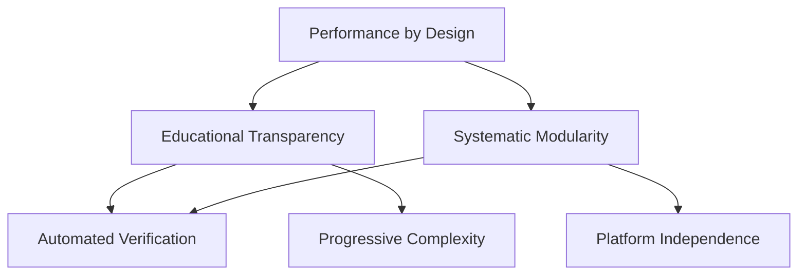
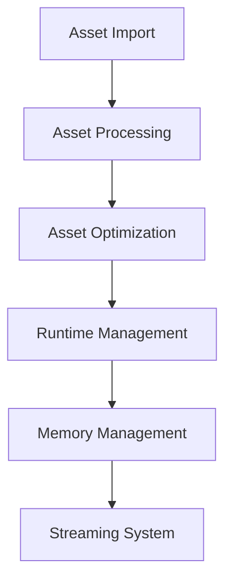
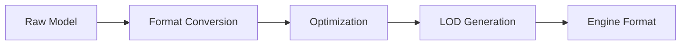
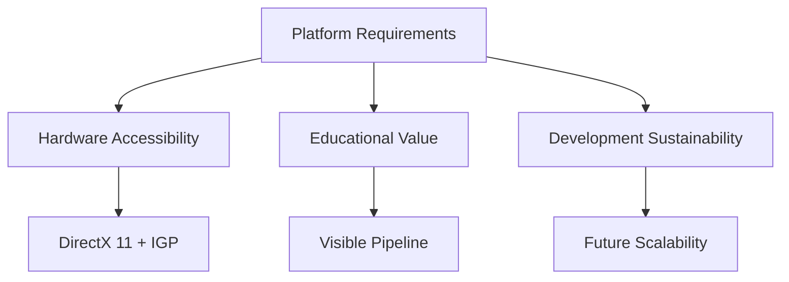
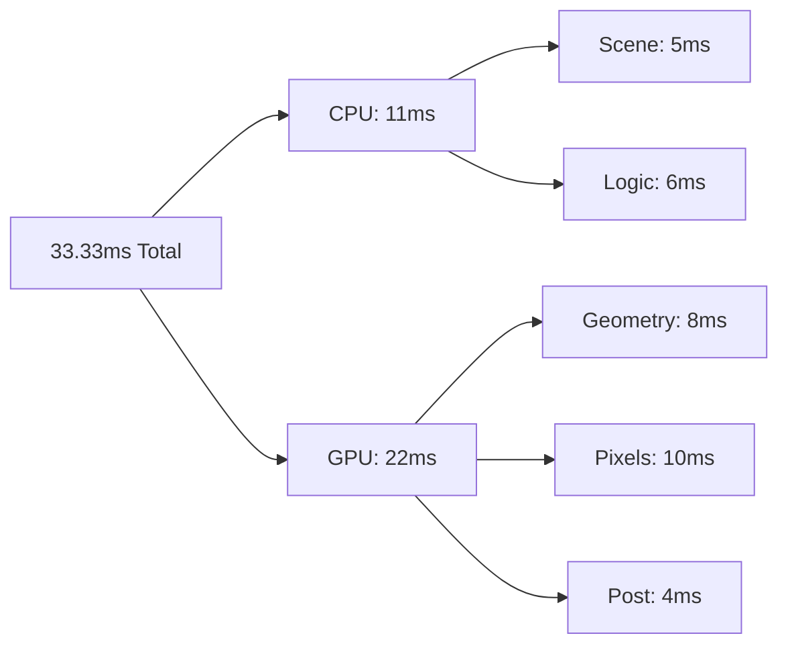
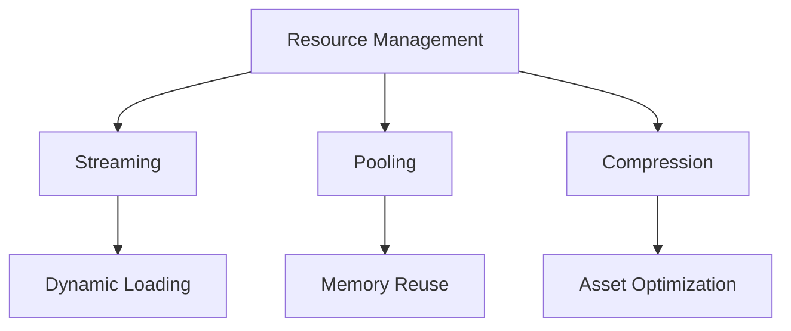
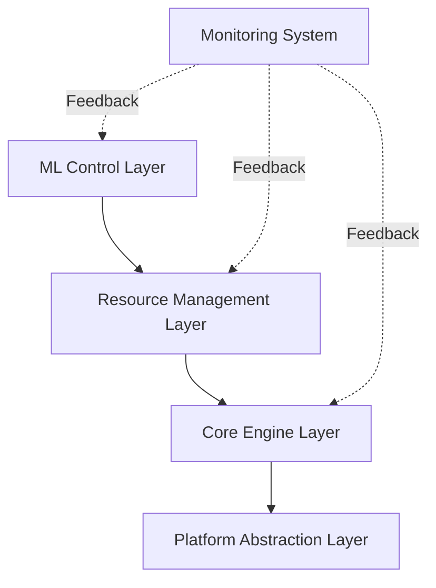
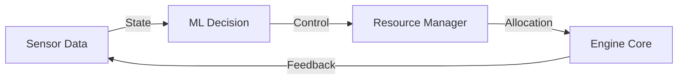
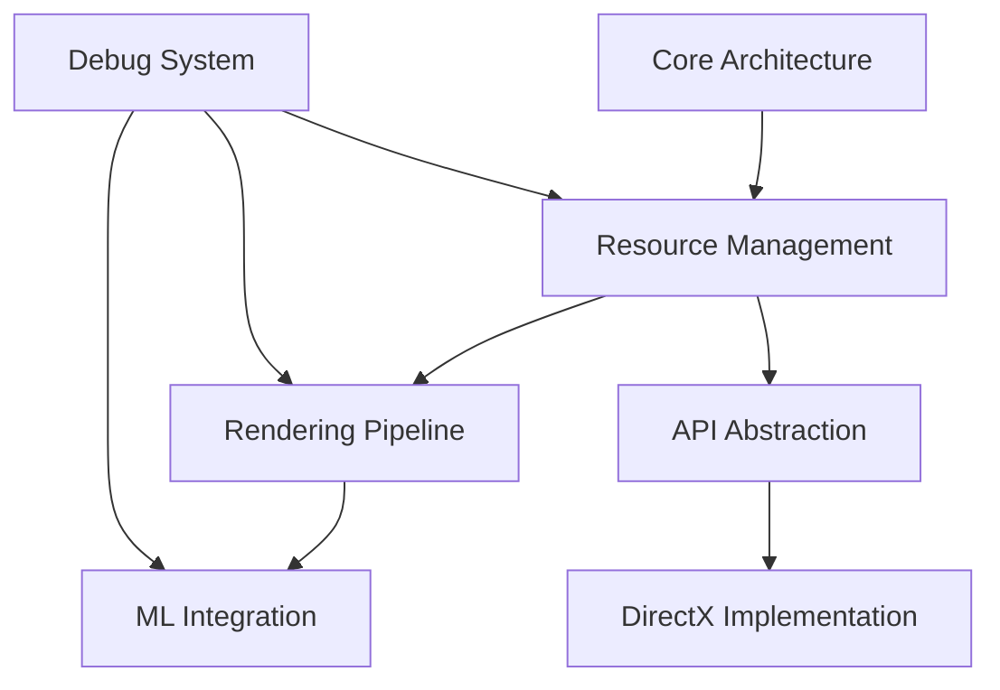

# VISION AND SCOPE DOCUMENT - YASHIMA ENGINE
### Version 1.0
#### Revision History
| Date | Version | Description | Author |
|------|---------|-------------|--------|
| 2024-01-05 | 1.0 | Initial version | Aria Argenta |

## 1. Project Vision
### 1.1 Problem Statement
The field of graphics programming presents a significant educational challenge: while theoretical resources are abundant, practical implementation experiences are scarce. This leads to several key issues:

**State of art**:
- Learning graphics programming typically involves either:
  - Following tutorials that don't scale to production needs
  - Diving into complex engines without understanding core concepts
- Documentation often explains *what* but rarely *why* and *how*
- Real-world optimization techniques remain largely inaccessible to learners

**Core Problems**:
1. **Knowledge Gap**: Disconnect between theory and practical implementation
2. **Learning Isolation**: Students often learn in isolation without seeing real development practices
3. **Documentation Depth**: Most resources don't capture the decision-making process behind architectural choices
4. **Best Practices**: Limited exposure to production-grade development workflows

**Impact**:
- Aspiring graphics programmers struggle to transition from learning to professional development
- Educational resources rarely align with industry practices
- Students miss crucial insights about performance optimization and architecture decisions

**Target Outcome**: 
The Yashima Engine will serve as both a learning platform and a practical rendering engine by:
- Providing a self-documenting, educational codebase
- Implementing professional development practices with detailed explanations
- Capturing architectural decisions and their rationale
- Demonstrating optimization techniques with clear performance metrics
- Creating a bridge between learning and professional development

This approach transforms the traditional engine development process into an educational journey, documented and structured for future graphics programming enthusiasts.

### 1.2 Technical Vision
#### 1.2.1 Rendering Goals
The Yashima Engine will implement a modern rendering architecture that:
- Demonstrates industry-standard rendering techniques
- Provides clear performance metrics and benchmarking tools
- Scales from basic rendering concepts to advanced graphics features
- Maintains educational value without compromising technical excellence

#### 1.2.2 Pipeline Architecture
The rendering pipeline will be implemented in progressive layers:

**Layer 1: Foundation**
- Basic rendering primitives
- Clear abstraction of graphics APIs
- Fundamental mathematics and graphics concepts
- Comprehensive debugging and visualization tools

**Layer 2: Core Systems**
- Modern rendering techniques (PBR, deferred rendering)
- Resource management and memory optimization
- Multi-threading architecture
- Performance profiling system

**Layer 3: Advanced Features**
- Post-processing effects
- Advanced lighting and shadow systems
- Scene management and culling optimizations
- Material system with shader permutations

#### 1.2.3 Core Systems Design
Each system will be implemented following these principles:

1. **Educational Clarity**
   - Documented code with detailed explanations
   - Step-by-step implementation guides
   - Performance impact analysis
   - Alternative implementation discussions

2. **Technical Excellence**
   - Industry-standard design patterns
   - Modern C++ practices
   - Robust error handling
   - Comprehensive unit testing

3. **Performance Optimization**
   - Clearly defined performance budgets
   - Optimization strategies documentation
   - Profiling and monitoring tools
   - Platform-specific considerations

4. **Development Workflow**
   - Professional CI/CD practices
   - Code review guidelines
   - Documentation requirements
   - Testing protocols

#### 1.2.4 Implementation Strategy
The engine will be developed through:
- Iterative development cycles
- Regular performance benchmarking
- Continuous documentation updates
- Community feedback integration
- Educational milestone releases

Each component will include:
- Technical specification
- Implementation guide
- Performance analysis
- Educational materials
- Practice exercises

### 1.3 Design Principles
The Yashima Engine's design principles are arranged in order of fundamental impact, following a hierarchical dependency model:

#### 1.3.1 Performance by Design
**Principle**: Performance considerations must be architectural, not afterthoughts.

**Justification**: Graphics performance is fundamentally tied to architectural decisions and cannot be effectively retrofitted.

**Implementation Guidelines**:
- All systems must specify performance budgets upfront
- Performance metrics must be measurable and monitored
- Critical paths must be identified and documented
- Memory access patterns must be explicitly designed
- Cache coherency must be considered in data structures

#### 1.3.2 Educational Transparency
**Principle**: Every technical decision must be traceable and comprehensible.

**Justification**: Understanding the 'why' behind technical decisions is crucial for both learning and maintenance.

**Implementation Guidelines**:
- All major decisions require documented Architecture Decision Records (ADRs)
- Performance implications must be quantified and explained
- Alternative approaches must be documented with trade-off analysis
- Implementation patterns must include educational context
- Debugging and profiling tools must be learning-oriented

#### 1.3.3 Systematic Modularity
**Principle**: Components must be self-contained but transparently interconnected.

**Justification**: Modular design enables both learning isolation and system scalability.

**Implementation Guidelines**:
- Clear interface boundaries between components
- Explicit dependency management
- Standardized communication patterns
- Documented component lifecycles
- Testable in isolation

#### 1.3.4 Automated Verification
**Principle**: All critical behaviors must be automatically verifiable.

**Justification**: Reliable learning requires consistent behavior validation.

**Implementation Guidelines**:
- Comprehensive unit testing framework
- Automated performance benchmarking
- Visual regression testing
- Memory leak detection
- API consistency validation

#### 1.3.5 Progressive Complexity
**Principle**: Features must follow a clear complexity progression.

**Justification**: Learning is optimized when complexity increases gradually.

**Implementation Guidelines**:
- Clear prerequisite chains
- Incremental feature implementation
- Documented complexity levels
- Optional advanced implementations
- Progressive optimization paths

#### 1.3.6 Platform Independence
**Principle**: Core concepts must be platform-agnostic.

**Justification**: Understanding should transcend specific APIs or hardware.

**Implementation Guidelines**:
- Abstract interface design
- Platform-specific implementation isolation
- Consistent abstraction layers
- Documented platform differences
- Portable algorithms

#### 1.3.7 Design Principle Matrix
| Principle | Impact Scope | Verification Method | Learning Value |
|-----------|--------------|---------------------|----------------|
| Performance by Design | System-wide | Benchmarking | High |
| Educational Transparency | Documentation | Review Process | Critical |
| Systematic Modularity | Architecture | Unit Testing | High |
| Automated Verification | Quality | CI/CD Pipeline | Medium |
| Progressive Complexity | User Experience | Learning Metrics | Critical |
| Platform Independence | Portability | Cross-platform Testing | Medium |

#### 1.3.8 Principle Dependencies

## 2. Core Components
### 2.1 Render Pipeline
#### 2.1.1 Core Pipeline Architecture Overview

#### 2.1.2 Implementation Strategy
The Yashima Engine supports two primary rendering paths, each serving different use cases and learning objectives:

#### 2.1.3 Forward Rendering
Primary implementation path focusing on clarity and direct understanding:
- Immediate feedback for learning
- Direct correlation between code and results
- Clear performance implications
- Straightforward debugging

#### 2.1.4 Deferred Rendering
Advanced implementation path demonstrating modern techniques:
- Separated geometry and lighting passes
- Multiple render targets
- Advanced lighting capabilities
- Performance optimization techniques

#### 2.1.5 Pipeline Stages
##### 2.1.5.1 Application Stage
**Purpose**: Scene data preparation and management.

**Implementation Details**:
- Scene graph management using hierarchical structures
- Frustum culling implementation with spatial partitioning
- Draw call sorting and batching optimization
- Resource management and streaming

**Learning Objectives**:
- Understanding spatial relationships in 3D
- Optimization techniques for large scenes
- Memory management principles
- Scene organization strategies

##### 2.1.5.2 Geometry Processing
**Purpose**: Vertex transformation and primitive setup.

**Implementation Details**:
- Vertex buffer organization and management
- Shader-based vertex transformation
- Primitive assembly configuration
- Vertex attribute handling

**Learning Objectives**:
- 3D mathematics fundamentals
- Coordinate space transformations
- Vertex shader programming
- GPU memory management

##### 2.1.5.3 Rasterization
**Purpose**: Converting 3D primitives to 2D fragments.

**Implementation Details**:
- Triangle setup and traversal
- Fragment generation
- Early depth testing
- Conservative rasterization options

**Learning Objectives**:
- Rasterization algorithms
- Screen-space operations
- Performance optimization techniques
- Hardware rasterizer concepts

#### 2.1.6 Performance Considerations
Each pipeline stage includes built-in performance monitoring:

| Stage | Metrics | Tools |
|-------|---------|-------|
| Geometry | Vertex count, transform time | Geometry profiler |
| Raster | Fill rate, overdraw | Pixel counter |
| Pixel | Shader complexity | GPU profiler |
| Output | Bandwidth usage | Frame analyzer |

#### 2.1.7 Debug Features
The pipeline includes comprehensive debugging capabilities:

1. **Visual Debugging**
   - Stage output visualization
   - Buffer inspection tools
   - Pipeline state display

2. **Performance Analysis**
   - Real-time statistics
   - Bottleneck identification
   - Optimization suggestions

3. **Learning Tools**
   - Step-by-step execution
   - State inspection
   - Tutorial integration

#### 2.1.8 Documentation Integration
Each pipeline component includes:
- Theoretical background
- Implementation details
- Performance considerations
- Practical exercises
- Further reading references

#### 2.1.9 References
- [Pipeline Implementation Guide](../tutorials/pipeline-implementation.md)
- [Performance Optimization Guide](../tutorials/optimization.md)
- [Debug Tools Documentation](../tools/debug-suite.md)

### 2.2 Asset Pipeline
#### 2.2.1 Core Asset Architecture

#### 2.2.2 Geometry Assets
**Types**:
- Static meshes
- Skeletal meshes
- LOD groups
- Collision meshes

**Processing Pipeline**:

#### 2.2.3 Texture Assets
**Types**:
- Diffuse maps
- Normal maps
- PBR material maps
- Environment maps

**Processing Pipeline**:

#### 2.2.4 Material Assets
**Types**:
- Standard materials
- Custom shaders
- Material instances
- Material functions

**Processing Pipeline**:

#### 2.2.5 Implementation Strategy
##### 2.2.5.1 Resource Management System
**Core Features**:
- Reference counting
- Memory budgeting
- Resource virtualization
- Async loading support

**Educational Focus**:
- Memory management principles
- Resource lifecycle understanding
- Optimization techniques
- Streaming strategies

##### 2.2.5.2 Memory Hierarchy
| Level | Purpose | Access Time | Size Constraints |
|-------|---------|-------------|------------------|
| GPU Memory | Active assets | Immediate | Platform dependent |
| System RAM | Ready pool | Fast | Several GB |
| Disk Cache | Quick loading | Medium | Platform storage |
| Storage | Asset repository | Slow | Project size |

#### 2.2.6 Asset Processing Pipeline
##### 2.2.6.1 Import Phase
**Purpose**: Convert external formats to engine-compatible data

**Implementation Details**:
- Format validation
- Data normalization
- Metadata extraction
- Initial optimization

**Learning Objectives**:
- File format understanding
- Data transformation concepts
- Validation techniques
- Pipeline automation

##### 2.2.6.2 Processing Phase
**Purpose**: Optimize and prepare assets for runtime use

**Implementation Details**:
- Compression application
- LOD generation
- Format optimization
- Platform-specific processing

**Learning Objectives**:
- Optimization techniques
- Platform considerations
- Memory management
- Performance trade-offs

##### 2.2.6.3 Runtime Phase
**Purpose**: Manage assets during engine execution

**Implementation Details**:
- Dynamic loading
- Memory management
- Reference tracking
- Resource streaming

**Learning Objectives**:
- Runtime optimization
- Memory hierarchies
- Resource lifecycle
- Streaming strategies

#### 2.2.7 Debug Features
##### 2.2.7.1 Asset Analysis Tools
- Size profiling
- Usage tracking
- Reference visualization
- Memory mapping

##### 2.2.7.2 Performance Monitoring
- Load time analysis
- Memory usage tracking
- Streaming metrics
- Bottleneck identification

##### 2.2.7.3 Documentation Integration
Each asset system includes:
- Technical specifications
- Implementation guides
- Optimization tutorials
- Best practices
- Example workflows

#### 2.2.8 References
- [Asset Pipeline Guide](../tutorials/asset-pipeline.md)
- [Resource Management](../tutorials/resource-management.md)
- [Memory Optimization](../tutorials/memory-optimization.md)

### 2.3 Performance Targets
The Yashima Engine's performance targets are established based on comprehensive analysis of hardware accessibility, educational value, and development sustainability. Our architectural decisions prioritize widespread adoption while maintaining educational clarity.

#### 2.3.1 Architectural Decision Record
##### 2.3.1.1 Platform Selection Rationale

**Key Decision Factors**:
| Factor | Weight | Justification |
|--------|--------|---------------|
| Hardware Availability | Critical | Most students have access to integrated graphics |
| API Maturity | High | DX11 offers stable drivers and wide support |
| Development Tools | High | Robust debugging and profiling tools available |
| Learning Curve | Medium | Balanced complexity for educational purposes |

##### 2.3.1.2 Base Performance Targets
**Frame Budget Distribution**:

#### 2.3.2 Hardware Tier Specifications
##### 2.3.2.1 Educational Baseline (Primary Focus)
**Target Hardware**:
- GPU: Intel UHD 620 or equivalent integrated graphics
- CPU: Intel i3 8th Gen / AMD Ryzen 3 2200G
- RAM: 8GB System Memory
- API: DirectX 11

**Performance Targets**:
- Resolution: 720p-1080p
- Frame Rate: 30 FPS stable
- Memory Usage: ≤ 2GB total
- Shader Model: 5.0

**Justification**:
- Most widely available hardware configuration
- Supports fundamental graphics concepts
- Adequate for learning pipeline basics
- Minimal barrier to entry

##### 2.3.2.2 Mainstream Development
**Target Hardware**:
- GPU: GTX 1650 / RX 580 / Intel Arc A380
- CPU: Intel i5 10th Gen / Ryzen 5 3600
- RAM: 16GB System Memory
- API: DirectX 11 with Vulkan capability

**Performance Targets**:
- Resolution: 1080p
- Frame Rate: 60 FPS
- Memory Usage: ≤ 4GB total
- Advanced shader features

##### 2.3.2.3 Extended Capabilities
**Target Hardware**:
- GPU: RTX 2060 / RX 5600 XT / Intel Arc A750
- CPU: Intel i7 11th Gen / Ryzen 7 3700X
- RAM: 16GB+ System Memory
- API: DirectX 11 + Vulkan

**Performance Targets**:
- Resolution: 1440p
- Frame Rate: 60+ FPS
- Memory Usage: ≤ 8GB total
- Full feature set

#### 2.3.3 Software Compensation Strategies
##### 2.3.3.1 Memory Management

**Implementation Priority**:
| Feature | Priority | Educational Value | Performance Impact |
|---------|----------|-------------------|-------------------|
| Texture Streaming | Critical | High | Significant |
| Resource Pooling | High | Medium | High |
| Asset Compression | Medium | Low | Medium |

#### 2.3.3.2 Performance Scaling
**Dynamic Feature Set**:
- Shader complexity levels
- LOD system
- Resolution scaling
- Effect quality tiers

**Educational Integration**:
- Performance profiling tools
- Pipeline visualization
- Resource monitoring
- Debug overlays

#### 2.3.4 Measurement and Validation
##### 2.3.4.1 Performance Metrics
| Metric | Target | Minimum | Measurement Method |
|--------|--------|---------|-------------------|
| Frame Time | 33.33ms | 40ms | Built-in profiler |
| Memory Use | 2GB | 1GB | Resource tracker |
| Load Time | 5s | 10s | Asset loading monitor |
| Draw Calls | 1000 | 500 | Pipeline statistics |

##### 2.3.4.2 Educational Metrics
| Aspect | Measurement | Tool |
|--------|-------------|------|
| Pipeline Understanding | Stage visualization | Debug overlay |
| Resource Management | Memory tracking | Resource viewer |
| Performance Analysis | Frame timing | Performance HUD |
| Feature Learning | Tutorial completion | Progress tracker |

#### 2.3.5 Development Guidelines
##### 2.3.5.1 Implementation Priorities
1. Core rendering functionality
2. Resource management system
3. Performance optimization tools
4. Educational features
5. Advanced capabilities

##### 2.3.5.2 Documentation Requirements
- Architecture decisions
- Performance implications
- Educational content
- Optimization guides

#### 2.3.6 References
- [Performance Optimization Guide](../tutorials/optimization.md)
- [Hardware Compatibility Matrix](../specs/hardware-compatibility.md)
- [Educational Feature Set](../docs/educational-features.md)

## 3. Technical Architecture
### 3.1 Layer System
The Yashima Engine implements a layered architecture inspired by industrial control systems, specifically the centrifugal governor and hydraulic control principles. This design focuses on efficient resource management through rapid, binary decision-making processes.

#### 3.1.1 Core Architectural Principles
##### 3.1.1.1 Layer Definitions

##### 3.1.1.2 Machine Learning Control Layer
- Purpose: Binary decision-making for resource allocation
- Responsibility: Fast, focused control decisions
- Characteristics:
  - Microsecond response time
  - Minimal resource footprint
  - Binary output decisions
  - Deterministic behavior

##### 3.1.1.3 Resource Management Layer
- Purpose: System resource distribution and control
- Responsibility: Resource allocation and throttling
- Characteristics:
  - Real-time resource monitoring
  - Threshold-based control
  - Predictable response patterns
  - Self-regulating behavior

##### 3.1.1.4 Core Engine Layer
- Purpose: Fundamental rendering operations
- Responsibility: Graphics pipeline execution
- Characteristics:
  - Direct hardware interaction
  - Performance-critical operations
  - Resource consumption reporting
  - State management

##### 3.1.1.5 Platform Abstraction Layer
- Purpose: Hardware and API abstraction
- Responsibility: Platform-specific implementation
- Characteristics:
  - Hardware interface
  - API compatibility
  - Driver interaction
  - System capabilities detection

#### 3.1.2 Layer Communication

#### 3.1.3 Implementation Strategy
1. Control Flow
    - Clearly defined interfaces between layers
    - ML Layer: Binary decisions
    - Resource Layer: Resource distribution
    - Core Layer: Rendering operations
    - Platform Layer: Hardware interface

2. Communication Patterns
    - Unidirectional data flow
    - Clear feedback loops
    - Minimal cross-layer dependencies
    - Standardized interfaces
    - Resource Management
    - Decision threshold: 100 microseconds
    - Feedback interval: 16 milliseconds
    - Adjustment rate: 0.1

3. Resource Management
    - Decision threshold: 100 microseconds
    - Feedback interval: 16 milliseconds
    - Adjustment rate: 0.1

#### 3.1.4 Architectural Decisions
##### 3.1.4.1 ML Integration (ADR-001)
- Decision: Implement focused, binary ML controller
- Rationale: Optimize for speed and simplicity
- Consequences:
  - Predictable performance
  - Minimal resource overhead
  - Reduced maintenance
  - Clear failure modes

##### 3.1.4.2 Layer Separation (ADR-002)
- Decision: Strict layer boundaries with defined interfaces
- Rationale: Maintain system stability and clarity
- Consequences:
  - Clear responsibility separation
  - Simplified testing
  - Improved maintainability
  - Controlled dependencies

##### 3.1.4.3 Resource Management (ADR-003)
- Decision: Self-regulating resource control system
- Rationale: Ensure system stability and efficiency
- Consequences:
  - Predictable behavior
  - Automatic adjustment
  - Efficient resource usage
  - Natural load balancing

#### 3.1.5 Performance Considerations
##### 3.1.5.1 Response Times
| Layer | Target Response | Priority |
|-------|-----------------|----------|
| ML Control | 100μs | Critical |
| Resource Management | 1ms | High |
| Core Engine | 16ms | Standard |
| Platform | Variable | Low |

##### 3.1.5.2 Resource Allocation
- ML Layer: Maximum 1% system resources
- Resource Management: Maximum 5% system resources
- Core Engine: Maximum 90% system resources
- Platform Layer: Maximum 4% system resources

## 4. Technical Specifications
### 4.1 Rendering Features
#### 4.1.1 Feature Priority Matrix

| Feature | Priority | Hardware Requirements | Educational Value |
|---------|----------|---------------------|-------------------|
| Forward Rendering | Must-Have | Baseline | Critical |
| Basic Lighting | Must-Have | Baseline | High |
| Texture Mapping | Must-Have | Baseline | High |
| Simple Shaders | Must-Have | Baseline | Critical |
| Post-Processing | Optional | Enhanced | Medium |
| Advanced Lighting | Optional | Enhanced | Medium |
| Deferred Rendering | Future | High-End | Advanced |

#### 4.1.2 Core Features Implementation
##### 4.1.2.1 Forward Rendering Pipeline
- Purpose: Basic rendering path implementation
- Target Performance: 30 FPS at 720p-1080p
- Characteristics:
  - Single-pass rendering
  - Direct lighting calculations
  - Immediate mode rendering
  - Basic depth testing

##### 4.1.2.2 Basic Lighting System
- Purpose: Fundamental lighting calculations
- Implementation:
  - Directional lights
  - Point lights
  - Basic shadows
  - Diffuse lighting

##### 4.1.2.3 Texture System
- Purpose: Material and surface representation
- Features:
  - Diffuse textures
  - Basic UV mapping
  - Texture filtering
  - Mipmap support

##### 4.1.2.4 Shader Implementation
- Purpose: Programmable rendering pipeline
- Core Shaders:
  - Vertex shaders
  - Pixel shaders
  - Basic compute shaders
  - Debug visualization

#### 4.1.3 Performance Targets
##### 4.1.3.1 Baseline Configuration
- Resolution: 720p
- Frame Rate: 30 FPS stable
- Draw Calls: ≤ 1000 per frame
- Triangles: ≤ 100,000 per frame

##### 4.1.3.2 Enhanced Configuration
- Resolution: 1080p
- Frame Rate: 60 FPS target
- Draw Calls: ≤ 2000 per frame
- Triangles: ≤ 250,000 per frame

#### 4.1.4 Educational Integration
##### 4.1.4.1 Pipeline Visualization
- Purpose: Render pipeline understanding
- Features:
  - Step-by-step execution
  - State visualization
  - Buffer inspection
  - Performance metrics

##### 4.1.4.2 Debug Features
- Purpose: Learning and troubleshooting
- Tools:
  - Frame debugger
  - Shader debugger
  - Resource viewer
  - Performance profiler

#### 4.1.5 Technical Constraints
##### 4.1.5.1 Hardware Limitations
- Minimum GPU: Intel UHD Graphics 620
- Minimum API: DirectX 11
- Minimum Memory: 2GB VRAM/Shared
- Minimum Bandwidth: 25GB/s

##### 4.1.5.2 Software Dependencies
- DirectX SDK
- Platform Tools
- Debug Runtime
- Development Tools

#### 4.1.6 Feature Scaling
##### 4.1.6.1 Quality Levels
- Low: Basic features only
- Medium: Added post-processing
- High: Full feature set

##### 4.1.6.2 Performance Scaling
- Resolution scaling
- LOD system
- Effect quality
- Draw distance

### 4.2 Performance Budgets
## 4.2 Performance Budgets
#### 4.2.1 Frame Budget Distribution
##### 4.2.1.1 Target Frame Times
| Phase | OpenGL (ms) | DirectX 11 (ms) | Budget % |
|-------|------------|-----------------|-----------|
| CPU Preparation | 5.5 | 5.5 | 16.5% |
| Draw Call Submission | 4.0 | 3.5 | 12.0% |
| GPU Rendering | 20.0 | 20.0 | 60.0% |
| Present/Sync | 3.5 | 4.0 | 11.5% |
| **Total** | **33.33** | **33.33** | **100%** |

##### 4.2.1.2 GPU Timeline
- Vertex Processing: 7.0ms
- Fragment Processing: 9.0ms
- Texture Sampling: 2.5ms
- Post-Processing: 1.5ms

#### 4.2.2 Memory Allocation
##### 4.2.2.1 Runtime Memory Budget
| Resource Type | Size (MB) | Priority |
|--------------|-----------|-----------|
| Textures | 512 | High |
| Meshes | 256 | High |
| Shaders | 64 | Critical |
| Buffers | 128 | High |
| ML Model | 1 | Critical |
| System | 64 | Medium |
| **Total** | **1024** | - |

##### 4.2.2.2 Resource Limits
- Maximum Texture Size: 2048x2048
- Maximum Vertex Count: 100,000 per frame
- Maximum Draw Calls: 1,000 per frame
- Maximum Shader Instructions: 512

#### 4.2.3 Bandwidth Constraints
##### 4.2.3.1 Memory Bandwidth
| Operation | Budget (GB/s) | Notes |
|-----------|--------------|-------|
| Texture Reads | 8.0 | Including mipmaps |
| Vertex Fetch | 4.0 | Including cache |
| Buffer Updates | 2.0 | Dynamic resources |
| ML Operations | 0.5 | Control decisions |
| **Total** | **14.5** | Per frame |

##### 4.2.3.2 PCIe Bandwidth
- Host to Device: 2GB/s
- Device to Host: 1GB/s
- Resource Streaming: 500MB/s

#### 4.2.4 CPU Utilization
##### 4.2.4.1 Thread Budget
| Thread Type | Usage % | Priority |
|-------------|---------|-----------|
| Main Thread | 30% | Critical |
| Render Thread | 40% | Critical |
| Resource Thread | 15% | High |
| ML Thread | 5% | Medium |
| Worker Threads | 10% | Medium |

##### 4.2.4.2 Core Distribution
- Main/Render: Dedicated core
- Resources: Shared core
- ML/Workers: Shared core
- System: Remaining cores

#### 4.2.5 Power Budget
##### 4.2.5.1 Mobile/Integrated
| Component | Power Target (W) |
|-----------|-----------------|
| GPU Processing | 10-15 |
| CPU Usage | 5-8 |
| Memory | 2-3 |
| System | 2-4 |
| **Total** | **19-30** |

##### 4.2.5.2 Desktop/Dedicated
| Component | Power Target (W) |
|-----------|-----------------|
| GPU Processing | 75-100 |
| CPU Usage | 25-35 |
| Memory | 10-15 |
| System | 15-20 |
| **Total** | **125-170** |

#### 4.2.6 Monitoring and Control
##### 4.2.6.1 Performance Metrics
- Frame Time: 33.33ms target
- Frame Rate Stability: ±5%
- Memory Usage: <90% allocation
- Temperature: <85°C GPU/CPU

##### 4.2.6.2 Control Actions
- Dynamic resolution scaling
- LOD adjustment
- Texture quality reduction
- Draw distance modification
- ML control frequency adaptation

## 5. Development Roadmap
#### 5.1 Development Phases
##### 5.1.1 Foundation Phase (Q1)
- Purpose: Establish core architecture and basic systems
- Focus: Infrastructure and critical paths
- Deliverables:
  - Basic OpenGL rendering pipeline
  - Resource management system
  - Memory allocation framework
  - Core debugging tools

##### 5.1.2 Critical Systems Phase (Q2)
- Purpose: Implement essential rendering features
- Focus: Basic rendering capabilities
- Deliverables:
  - Forward rendering pipeline
  - Basic shader system
  - Texture management
  - Simple geometry pipeline

##### 5.1.3 ML Integration Phase (Q2-Q3)
- Purpose: Implement resource control system
- Focus: Performance optimization
- Deliverables:
  - ML control system
  - Resource monitoring
  - Performance metrics
  - Feedback loops

##### 5.1.4 API Expansion Phase (Q3-Q4)
- Purpose: DirectX 11 implementation
- Focus: API abstraction
- Deliverables:
  - DirectX 11 backend
  - API abstraction layer
  - Platform-specific optimizations
  - Cross-API validation

#### 5.2 Development Dependencies

#### 5.3 Risk Management
##### 5.3.1 Technical Risks
| Risk | Impact | Probability | Mitigation |
| Performance Issues | High | Medium | Early | profiling and benchmarking |
| API Compatibility | High | Medium | Robust abstraction | layer |
| ML Integration | Medium | High | Phased implementation |
| Resource Leaks | High | Low | Comprehensive testing |

5.3.2 Development Risks
Risk	Impact	Probability	Mitigation
Scope Creep	High	High	Clear phase boundaries
Technical Debt	Medium	High	Regular refactoring
Integration Issues	High	Medium	Continuous integration
Documentation Gaps	Medium	Medium	Documentation as code
5.4 Quality Gates
5.4.1 Phase Transition Criteria
Unit test coverage ≥ 80%
No critical bugs
Performance metrics met
Documentation complete
Code review approved
5.4.2 Quality Metrics
Performance targets achieved
Memory leaks addressed
API compliance verified
Educational value validated
5.5 Educational Integration
5.5.1 Documentation Requirements
Architecture documentation
Implementation guides
Performance analysis
Debug procedures
Educational examples
5.5.2 Learning Milestones
Basic rendering concepts
Resource management principles
Performance optimization
API abstractions
ML integration
5.6 Development Workflow
5.6.1 Sprint Structure
2-week sprints
Daily stand-ups
Sprint planning
Retrospectives
Documentation reviews
5.6.2 Development Practices
Test-driven development
Continuous integration
Code review requirements
Documentation updates
Performance monitoring

## 6. Technical Risks & Mitigations
### 6.1 Performance Risks
| Risk | Impact | Mitigation Strategy |
|------|---------|-------------------|
| [Risk] | High/Medium/Low | [Strategy] |

### 6.2 Technical Debt Considerations
- Identified Technical Debt
- Management Strategy
- Resolution Timeline

## 7. Tools & Infrastructure
### 7.1 Development Tools
- Build System
- Asset Pipeline Tools
- Debug & Profiling Tools

### 7.2 Testing Infrastructure
- Unit Testing Framework
- Performance Testing Suite
- Validation Tools

## 8. Documentation
### 8.1 Technical Documentation
- Architecture Documentation
- API Documentation
- Performance Guidelines

### 8.2 Developer Resources
- Setup Guides
- Best Practices
- Coding Standards

## Appendices
### A. Technical Glossary
| Term | Definition |
|------|------------|
| [Term] | [Definition] |

### B. Technical References
- DirectX Documentation
- Graphics Programming Resources
- Platform-Specific Guidelines