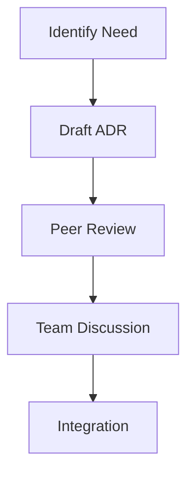
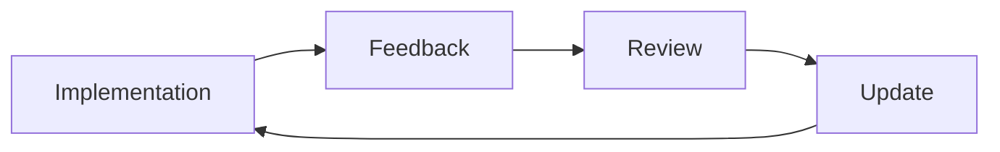
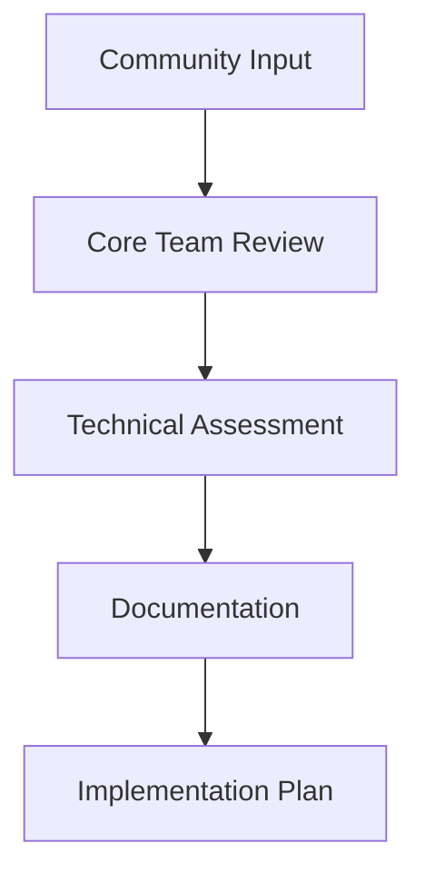

# ADR Governance
## Document Evolution Process
### 1. Criteria for New ADRs
An architectural decision requires a new Architecture Decision Record when it:
- Affects multiple system components
- Changes system behavior or performance
- Introduces new dependencies
- Modifies existing architectural patterns
- Impacts educational value

### 2. Submission Process

### 3. Review Channels
| Channel | Purpose | Participants |
|:-------:|:-------:|:------------:|
| GitHub Discussions | Initial proposal | All contributors |
| Pull Requests | Formal review | Core team |
| Issues | Problem tracking | All stakeholders |
| Request For Comments | Major changes | Community |

## 4. Documentation Standards
- Use established ADR template
- Include context and rationale
- Document alternatives considered
- Specify impact on existing architecture
- Reference related decisions

## 5. Version Control
- ADRs are never deleted
- Use status changes to mark evolution
- Maintain links between related ADRs
- Track superseded decisions

## 6. Quality Gates
| Gate | Requirement | Validation |
|:----:|:-----------:|:----------:|
| Completeness | All sections filled | Review checklist |
| Clarity | Clear reasoning | Peer review |
| Impact | Consequences documented | Team assessment |
| Technical | Implementation viable | Technical review |

## 7. Continuous Improvement
### 7.1 Regular Reviews
- Monthly architecture reviews
- Quarterly strategy alignment
- Annual architecture assessment

### 7.2 Feedback Loops

## 8. Community Input
### 8.1 Contribution Channels
- GitHub Discussions for proposals
- Issue templates for problems
- RFC process for major changes
- Regular community meetings

### 8.2 Decision Process

9. Educational Alignment
Document learning implications
Update tutorial content
Maintain example consistency
Track educational impact
10. Implementation Tracking
Phase	Deliverable	Validation
Proposal	Draft ADR	Community review
Review	Final ADR	Core team approval
Implementation	Code changes	Technical review
Documentation	Updated docs	Documentation team