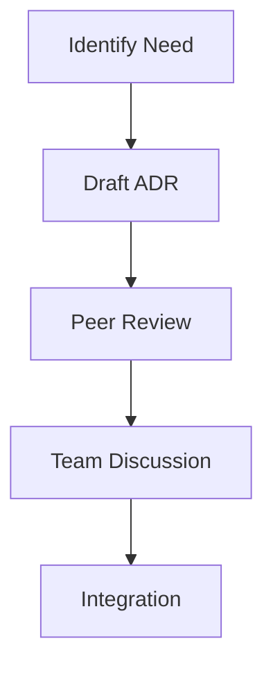

# ADR Governance
## Document Evolution Process
### 1. Criteria for New ADRs
An architectural decision requires a new ADR when it:
- Affects multiple system components
- Changes system behavior or performance
- Introduces new dependencies
- Modifies existing architectural patterns
- Impacts educational value

### 2. Submission Process

### 3. Review Channels
| Channel | Purpose | Participants |
|:-------:|:-------:|:------------:|
| GitHub Discussions | Initial proposal | All contributors |
| Pull Requests | Formal review | Core team |
| Issues | Problem tracking | All stakeholders |
| Request For Comments | Major changes | Community |